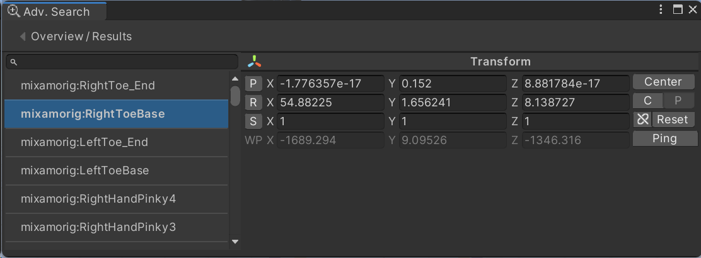
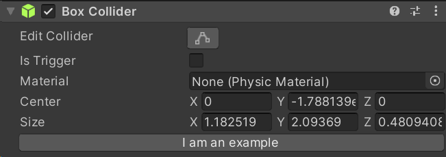

<h1 align="center">Welcome to GuiUtils 👋</h1>
<p>
  <a href="https://www.apache.org/licenses/LICENSE-2.0.txt" target="_blank">
    
  </a>
  <a href="https://github.com/Rhinox-Training/rhinox-guiutils/pulls"></a>
  <a href="https://openupm.com/packages/com.rhinox.open.guiutils/" target="_blank">
    
  </a>
</p>

> GUI Utils for Unity projects, mostly Editor extensions. (Optional Odin extensions)

## Install

This package is being hosted on [openupm](https://openupm.com/packages/com.rhinox.open.guiutils/).
If you have their CLI installed you can use the following command.

```sh
openupm install com.rhinox.open.guiutils
```

If not, you can manually edit the manifest.json (as described on the openupm page) or install it as a git package using the following url:
`https://github.com/Rhinox-Training/rhinox-guiutils?path=/Assets/GUIUtils`

## Dependencies

- Lightspeed (https://github.com/Rhinox-Training/rhinox-lightspeed)

## Content

GuiUtils offers shortcuts and extensions for making editors in Unity. It contains many baseclasses, methods of making custom GUI, and an entire system of creating drawers for unknown types.
It uses a stub of [Odin](https://odininspector.com/) attributes to provide an array of utility (much less than Odin but still a fair amount) to your inspector without creating a custom drawer. When Odin is included, it seamlessly lets odin handle all drawing (you might need to restart Unity).
It builds further upon [Lightspeed](https://github.com/Rhinox-Training/rhinox-lightspeed) and works as the basis of our other core package:  [Utilities](https://github.com/Rhinox-Training/rhinox-utilities).

Please explore the code for a proper overview but here's a quick sample:

#### Various Base classes
- `MenuListEditorWindow` provides a list on the left with selectable items
- `PagerEditor` / `PagerEditorWindow` which allows you to turns your editor into pages and provides a navigation bar with clickable history

- `DefaultEditorExtender` allows you to add upon existing editors (even native ones) or toggle back to them back on some condition.
  ```cs
  [CustomEditor(typeof(BoxCollider))]
  public class BoxColliderExtender : DefaultEditorExtender<BoxCollider>
  {
      public override void OnInspectorGUI()
      {
          base.OnInspectorGUI();
          GUILayout.Button("I am an example");
      }
  }
  ```
  
- `CustomSceneOverlayWindow` allows you to add small overlay editors inside the scene window. This is the same API that for example 'navigation' natively uses and will work nicely with it.
  
- and many others...

#### Various utilities
- `GenericPicker` a popup window for selecting from many items, with search bar, etc.
- `eUtility`, a static class with a bunch of useful methods like:
  - `ReadCsv` parses csv from string
- `GUIContentHelper`, a static class with a bunch of useful methods like:
  - `TempContent` uses a reusable GUIContent so it does not allocate
  - `Push` & `Pop` methods, to easily switch GUI.color, GUI.enabled, indent, ..
- `SceneOverlay` to push thing to the scene overlay like `CustomSceneOverlayWindow``does without that context
- `DialogData`, to easily create dynamic dialog popups
  ```cs
  EditorInputDialog.Create("GUID", "Find an asset from it's GUID.")
    .TextField("Guid:", out var guid) // Many types supported, Dropdown, FileField, ...
    .OnAccept(() => { FindAssetByGuid(guid); }) // OnCancel, ...
    .Show(); // ShowInPopup, ShowBlocking, ...
  ```
- `UnityIcon` static way of accessing a lot of icons, i.e. `UnityIcon.InternalIcon("icon_name")`
- `PersistentValue` a way to write values linked to certain data
- `MemberHelper` makes it easy to access field through reflection on objects. Used by our custom drawer system, so it also resolves paths, etc.

#### Custom Drawer system

You can mark any `Monobehaviour`/`ScriptableObject` class with the `[SmartFallbackDrawn]` attribute to make it be drawn with our custom system. Doing this will provide support for an array of Odin attributes, and cause (serialized/visible) fields that unity does not draw, to be exposed.

It was/is intended as a (very basic) open-source fallback version for Odin Inspector that allows you to expose some of its functionality to end users that do not have it available.

We've chosen to not make this automatic as there are still some issues to kink out.
You can also 'preview' the change by clicking the wand icon.   


You can make any object draw with a simple
```cs
var drawable = DrawableFactory.CreateDrawableFor(o);
drawable.Draw(GUIContent.none);
```

#### Supported Odin Attributes

Quick note in advance: there is no support expressions in attribute string params like Odin does, and I'm not really planning to add it. We do provide support for paths and some custom values (i.e. `$property`, `$value`, ...). We've named our systems variables the same as Odin (where applicable) so you can use them with both systems. i.e. `$property.Parent` will work.

- `[ShowInInspector]` causes a (non-serialized) field/property to be shown in the inspector.
- `[Button]` makes a button in the inspector that invokes the method
- `[ValueDropdown]` allows you to specify a list of values and gives you a dropdown
- `[FilePath]` & `[FolderPath]` adds an icon that opens a filebrowser
- `[HideIf]` & `[ShowIf]` allows you to specify a condition where the field should be hidden
- `[DisableIf]` & `[EnableIf]` allows you to specify a condition where the field should be disabled
- `[OnValueChanged]` invokes a method when the value changes
- `[HideLabel]` hides the label of the field
- `[InlineButton]` adds a small button to the right of the field that invokes a method
- `[InlineEditor]` adds a (collapsible) editor of the value in this field
- `[LabelText]` changes the text of the field
- `[DisplayAsString]` Draws the field as a label
- `[CustomValueDrawer]` allows you to provide inline editor code to draw a certain field
- All group drawable attributes (TabGroup, Horizontal, Vertical, Title, ...)
- Support for `[IncludeMyAttributes]`, implemented in: `[ShowInEditor]`, `[ShowReadOnly]`
- And many others...


#### Custom attributes
- `[AssignableTypeFilter(typeof(T))]` Put it on a (Serializable)Type variable to get a dropdown with only options that inherit from the given type.
- `[FittedLabel]` makes your label only take up the width it needs
- `[ShaderParameterSelector]` makes a dropdown of all parameters for the given shader, and given type
- `[TagSelector]`, `[Layer]`, `[NavMeshArea]` dropdown of all unity tags / navmesh areas / layers
- `[OptionalValue]` adds an icon that provides a tooltip and fades it out slightly, to indicate it does not matter much
- `[OrderBefore]` & `[OrderAfter]` draws a property after the given member
- And many others...

## Optional dependencies

- [Odin Inspector](https://odininspector.com/)
  - It features some optional features/dependencies on Sirenix Odin Inspector (see https://odininspector.com/ for information on how to get/buy Odin)

## Contribution guidelines

- This library contains efficient and generic GUI utilities.
- It contains a few non-Editor utilities but most of that kind of utilities can be found in [Lightspeed](https://github.com/Rhinox-Training/rhinox-lightspeed).
- It is intended to not execute anything, only provide helper functions / data objects.
  - So no (registered) editor windows
  - No (automatic) hooks into the editor
  - Not even inheriting from monobehaviour

See the [Utilities](https://github.com/Rhinox-Training/rhinox-utilities) package if you are interested in contributing something along those lines.


## Show your support

- Feel free to make an issue if you find any problems
- Feel free to make a pull request if you wish to contribute
- Give a ⭐️ if this project helped you!

## 📝 License

This project is [Apache--2.0](https://www.apache.org/licenses/LICENSE-2.0.txt) licensed.

Parts of the code come from external authors or are being reused from other open source projects:
- [UnityGUIChartEditor](https://github.com/alessandroTironi/UnityGUIChartEditor) - (c) Alessandro Tironi 2019 (MIT License)
- [Deform](https://github.com/keenanwoodall/Deform) - (c) Keenan Woodall (MIT License)
